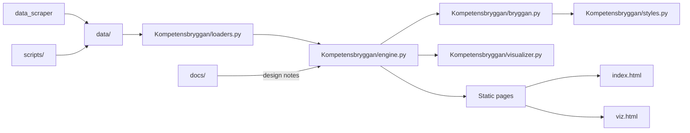

# NordiqFlow - Sveriges Arbetsmarknads-OS

> **En unified intelligence platform** som kombinerar Sveriges kompletta arbetsmarknadsdata (Arbetsförmedlingens Open Data) till två produkter: TalentFlow (B2C) och CityIQ (GovTech).

---

## 🎯 Vision

Dagens rekryteringssajter är enkla sökmotorer. NordiqFlow är en **semantisk graf över hela den svenska arbetsmarknaden** som möjliggör:

- **För individer**: AI-drivna karriärövergångar baserade på faktiska skill-överlappar
- **För kommuner**: Exakt talangbristanalys kopplad till utbildningspipeline

---

## 🏗️ Arkitektur

```
┌─────────────────────────────────────────────────────┐
│          ARBETSFÖRMEDLINGENS DATAKATALOG            │
│                                                      │
│  • Taxonomy (60+ datasets, SSYK/SNI/SUN)           │
│  • JobSearch (real-time job ads)                    │
│  • Enrichments (NLP skill extraction)               │
│  • Historical Data (10+ years trends)               │
└──────────────────┬──────────────────────────────────┘
                   │
            ┌──────▼─────┐
            │  Supabase  │  PostgreSQL + pgvector
            │  (Backend) │  (Unified Intelligence Layer)
            └──────┬─────┘
                   │
        ┌──────────┴──────────┐
        │                     │
    ┌───▼───┐             ┌──▼────┐
    │Talent │             │ City  │
    │ Flow  │             │  IQ   │
    │       │             │       │
    │ Gratis│             │ B2G   │
    └───────┘             └───────┘
```

---

## Architecture — call graph


You can also find the Mermaid source for the diagram at `docs/call_graph.mmd` and a one-page mapping at `docs/CALL_GRAPH.md`.




## 📦 Produkter

### 1️⃣ TalentFlow (Gratis för användare)
**Problem**: Personer vet inte hur deras skills överförs till andra yrken.

**Lösning**: AI-driven karriärplanering
- Input: "Jag är Butikschef inom Retail"
- Output: "Du kan bli Verksamhetschef inom Vård med 85% skill-match. Saknade skills: Vårdadministration (400 YH-timmar). Löneökning: +7k SEK/månad"

**Pris**: Gratis för alla användare (finansieras via kommunala CityIQ-licenser)

---

### 2️⃣ CityIQ (GovTech Dashboard)
**Problem**: Kommuner vet inte vilka kompetenser som saknas eller vilka utbildningar som ger ROI.

**Lösning**: Real-time talangbristanalys
- "Uppsala har 200 öppna Dev-jobs men bara 50 utexaminerade/år"
- "Finansiera en Cybersecurity YH (5M SEK/år) → Fyll 80 jobb → 3.2M SEK i kommunalskatt → ROI på 18 månader"

**Pris**: 50-200k SEK/år beroende på kommunstorlek

---

## 🔑 Konkurrensfördel

1. **Datamoat**: Ingen annan har byggt en unified graph över AF:s 60+ datasets
2. **Nätverkseffekter**: Fler TalentFlow-användare → bättre data → mer värde för CityIQ
3. **Regulatory capture**: Position oss som "infrastruktur" för statlig arbetsmarknadspolitik
4. **First-mover**: 10+ års historisk data → AI-modeller som konkurrenter inte kan replikera

---

## 📊 Business Model — Third-Party Payer

| Product | Target | ARR Potential (Year 2) |
|---------|--------|------------------------|
| TalentFlow | Gratis för alla användare | Ingår i CityIQ-licens |
| CityIQ + TalentFlow | 30 municipalities @ 75-250k/yr | 4.5M SEK |
| **TOTAL** | | **4.5M SEK** |

Modell: Kommunen köper CityIQ-licens, invånarna får TalentFlow gratis (som 1177).

---

## 🚀 Roadmap

### Phase 1: Foundation (Månader 1-4)
- [ ] Importera Taxonomy-data till Supabase (PostgreSQL + pgvector)
- [ ] Real-time JobSearch stream integration
- [ ] Build core API: `/transitions`, `/skill-index`, `/talent-gaps`
- [ ] Train ML models (salary prediction, demand forecasting)

### Phase 2: MVP Launch (Månader 5-8)
- [ ] TalentFlow web app (React)
- [ ] CityIQ pilot med 3 kommuner
- [ ] **Goal**: 400k SEK ARR

### Phase 3: Scale (Månader 9-18)
- [ ] TalentFlow mobile app + LinkedIn integration
- [ ] CityIQ expansion till 50 kommuner
- [ ] **Goal**: 6.6M SEK ARR

### Phase 4: Nordisk expansion (År 2-3)
- [ ] Norge (NAV APIs)
- [ ] Danmark (Jobindex)
- [ ] Finland (TE-palvelut)
- [ ] **Goal**: 40M SEK ARR

---

## 🛠️ Tech Stack

**Backend**:
- Supabase (PostgreSQL 15 + Auth + Storage + pgvector)
- Rekursiva CTEs för graf-liknande karriärvägs-queries
- Row-Level Security (RLS) för GDPR-compliance

**Frontend**:
- Next.js 15 (App Router, TypeScript, Tailwind CSS)
- D3.js (interaktiva visualiseringar)
- Vercel (hosting)

**AI & Data**:
- Anthropic Claude Sonnet 4.5 (CV-parsing, resumé-generering)
- Arbetsförmedlingens Open Data APIs (se `/docs/API_RESEARCH.md`)
- Plausible Analytics (GDPR-kompatibel)

---

## 📁 Repository Structure

```
nordiqflow/
├── README.md                    # This file
├── docs/
│   ├── API_RESEARCH.md         # AF API documentation deep dive
│   └── data_structure/
│       └── COMPLETE_GUIDE.md   # Complete data structure guide
├── scripts/
│   ├── test_apis.py            # API connectivity testing
│   └── requirements.txt        # Python dependencies
├── data_scraper/
│   ├── download_all_datasets.py # Download all AF datasets
│   ├── README.md               # Scraper documentation
│   └── requirements.txt        # Scraper dependencies
├── index.html                  # Landing page
└── vercel.json                 # Deployment config
```

---

## 🚦 Getting Started

### 1. Test AF APIs
```bash
cd scripts
pip install -r requirements.txt
python test_apis.py
```

### 2. Download All Datasets (NEW!)
```bash
cd data_scraper
pip install -r requirements.txt
python download_all_datasets.py
```

This will download 60+ datasets including:
- ⭐ **Släktskap mellan yrken** (pre-computed career transitions!)
- ⭐ **Yrkesbarometer** (5-year demand forecasts!)
- Complete SSYK, SNI, SUN taxonomies
- 8,000+ skill concepts

**See `/data_scraper/README.md` for full documentation.**

### 3. View Landing Page Locally
```bash
open index.html  # Mac
# or just double-click index.html
```

### 4. Deploy to Vercel
```bash
vercel
```

---

## 📞 Contact

**Linnea Moritz**  
- Portfolio: [linneamoritz.com](https://linneamoritz.com)
- GitHub: [@linneamoritznyc](https://github.com/linneamoritznyc)

---

## 📄 License

MIT
